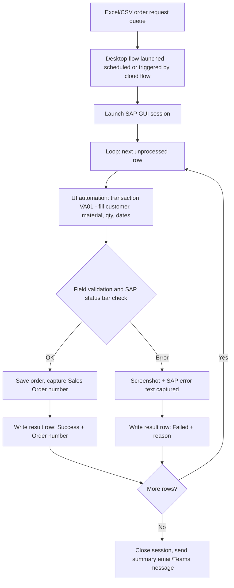

# Power Automate Desktop — SAP Sales Order Creation (RPA)

A portfolio reference build for unattended desktop automation: reading order requests from a source file, driving the SAP GUI (and equivalent browser-based ERP screens) to create sales orders, and logging every result for reconciliation — the pattern I use for legacy/portal systems that have no clean API to plug into.

Note: this repo documents the automation design and selector/error-handling approach used in client engagements (see my Upwork profile). It's a rebuilt reference version for demonstration — screen names, field values and volumes shown are sample data, not real client records.

## Problem

Order entry into SAP (or similar ERP/CRM screens without a usable API) is often still done by hand: opening a transaction, tabbing through fields, re-keying the same data from an Excel request. It's repetitive, error-prone at volume, and ties up a person for hours a day.

## Architecture

## How it works

1. Trigger: a Power Automate cloud flow drops a new order-request file into a watched folder and starts the desktop flow (via the Power Automate machine/gateway), or it runs on a schedule.
2. Session management: the desktop flow launches the SAP GUI scripting session, using UI element selectors (not just coordinates) so the flow survives minor screen/resolution changes.
3. Data-driven loop: rows are read from the request file with "Read from Excel worksheet"; each row maps to one sales order (customer, material, quantity, requested delivery date, plant).
4. Field entry and validation: values are typed into the VA01 transaction fields; after each save attempt the flow reads SAP's status bar text to distinguish success from a business-rule error (e.g. credit block, material not found) rather than assuming success.
5. Exception handling: on error, the flow captures a screenshot and the exact SAP message, logs it against that row, and continues to the next row instead of stopping the whole batch.
6. Reconciliation: a results file (or Dataverse table) ends up with one row per input order — Success + generated Sales Order number, or Failed + reason — so finance/ops can see exactly what happened without opening SAP.
7. Notification: a summary (processed / succeeded / failed counts) is posted to Teams or emailed at the end of the run.

## Design choices that matter for reliability

- Selector-based UI targeting, not fixed coordinates — resilient to window resizing and minor layout shifts.
- Explicit status-bar validation after every write — SAP GUI automation that clicks and hopes produces silent data errors; this flow checks before moving on.
- Row-level exception isolation — one bad row never aborts the whole batch.
- Human-readable audit trail — every run produces a result log, not just a pass/fail.

## Tech stack

- Power Automate Desktop (UI automation, SAP GUI scripting)
- Power Automate cloud flow (trigger/orchestration + notifications)
- Excel / CSV for input and result logging
- Microsoft Teams (run summary notifications)

## About

Built by Poorani R., Power Automate / RPA developer. See more automation projects on my Upwork profile (https://www.upwork.com/freelancers/~017d8cafb3f856e3f4) and other repos in this GitHub profile.
